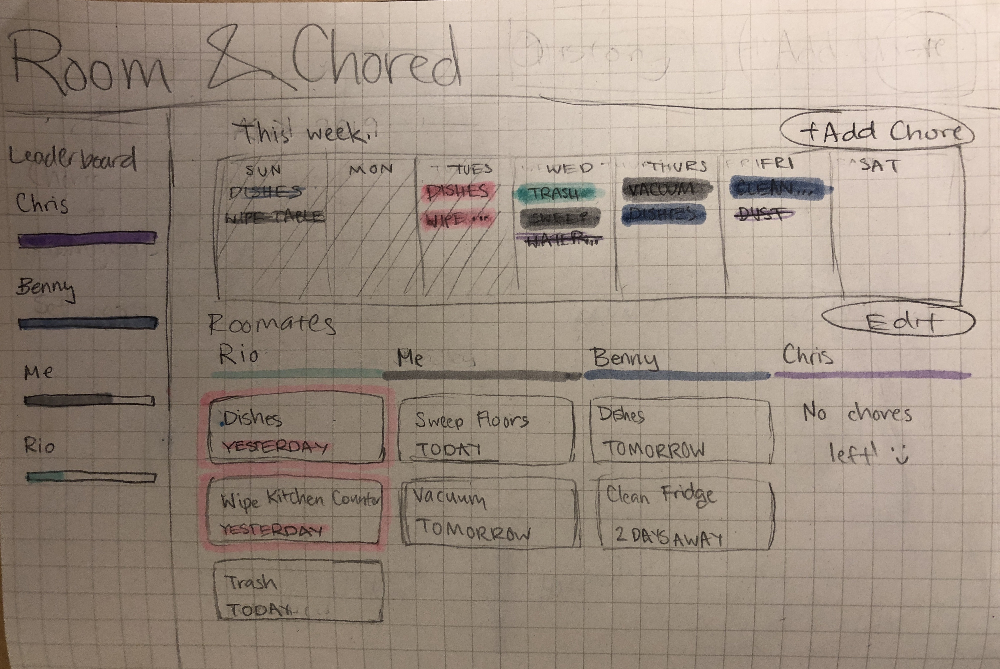
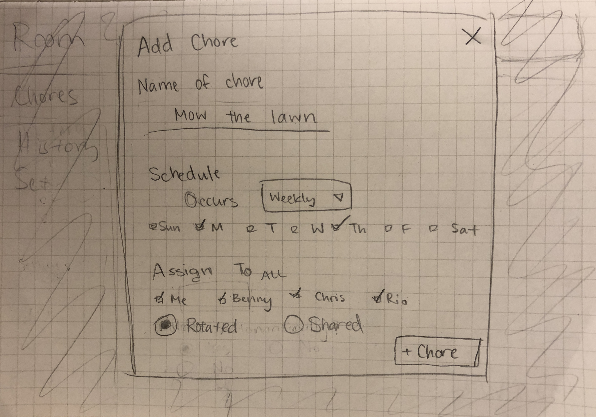
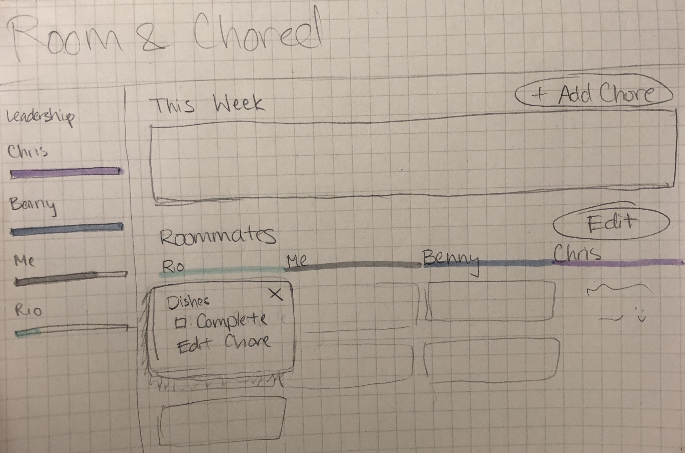
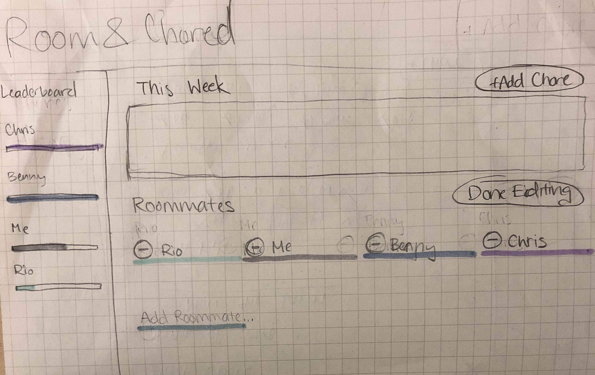

# Design Specification

## Problem
&nbsp;&nbsp;&nbsp;&nbsp;When living in a shared spaces, it is often difficult to manage tasks for house chores. What becomes of this is an unfair division of tasks. Additionally, some shirk their responsibilities onto other roommates who cannot tolerate dirty dishes, not vacuuming common space, and taking out trash. Since the days in which people have been living with one another, these struggles have always been present. It is no wonder that college students, who often rent out or dorm with strangers or acquaintances, get their fair share of arguments relating to unfinished chores.

&nbsp;&nbsp;&nbsp;&nbsp;[A study done by Arizona State University](https://phys.org/news/2013-11-division-household-chores-mess-tolerance.html) cites that the division of labor is due to the fact that people have differing levels of tolerance threshold. The higher one's tolerance threshold, the longer they'll hold off on completing a task until it reaches a crisis points. Oppositely, the lower one's threshold means they will likely take action before others in doing a chore. Another factor that made undone chores a burden was a student's living situation, which heightened the severity of the problem.

&nbsp;&nbsp;&nbsp;&nbsp;The living situation during college is a very tense environment. As most students entering a university setting are likely to live at local dorms, it can be seen that chores piled up is likely to cause quarrels. Sara Sanchez, who [studied the experiences of Freshman year living arrangements](https://digitalcommons.unl.edu/cgi/viewcontent.cgi?article=1092&context=cehsedaddiss), found that roommates were most of the negative experiences during that year. She notes that in one instance that one roommate had lashed out to the other about doing chores, and quickly ruined their relationship for the rest of the year.

&nbsp;&nbsp;&nbsp;&nbsp;As one can see, division of labor is a problem in a collegiate environment. Unfinished chores can build up, and subsequently diminish connections with others. Everyone has their own varying levels of a tolerance threshold that does not mesh well with those they live with.

## Solution
&nbsp;&nbsp;&nbsp;&nbsp;Our solution will be in the form of a responsive web application in order to appeal to a diverse audience. This will include popular operating systems such as Android, iOS, and Windows. This web application will take on modern design principles, such as the mobile-first design approach, to ensure that this application caters towards accessibility and ease of access.

### Functionality
&nbsp;&nbsp;&nbsp;&nbsp;This section goes over functionality inside of this application. This will go into detail about what the function is and how the user will interact to achieve this function.

* Dashboard
    * The dashboard is the only available page on our web application. It consists of three areas of funciontality: a weekly visual calendar (top right section), a chore list for each roommate (bottom right section), and a bar graph showing completion rates of all roommates (left section).
    
    * This is the core overview of all chores. This will help users visualize the distribution of chores across a shared living space.
* Weekly calendar
    * The view of this calendar will a have weekly format, allowing users to naturally see the chores they must complete within that week. It doesn't make sense to see chores in a monthly format, since that would show the week you have to do something. This is opposed to the week view, which shows more emphasis on the day in which you have to do something.
    * The name of each chore is displayed on the day that the chore is expected to by done by.
    * Chores on the calendar will be highlighted with a color. It is color-coded based on the person the chore is assigned to.
    * If a chore is completed, the color changes to a lighter shade of its original and the name of the chore will by striked through. This way completed chores will draw less attention on the calendar compared to incomplete chores.
    * This section will also contain a button labelled "Add Chore" that when clicked, the web app provides functionality to create and assign a new chore.
* Create and assign chore
    * User should be able to create a chore by clicking the "Add Chore" button located in the weekly calendar section.
    * When adding a chore, a modal pops up over the dashboard with information the user must fill out.
    
    * User must type in a name for the chore in the provided "Name of Chore" field.
    * User must choose how often the chore occurs by choosing an option from the drop down menu located next to the word "Occurs." Options consisted of "Once," "Weekly," "Bi-weekly," and "Monthly."
    * If the user chooses once, the web app will provide a field that allows the user choose a specific date by typing it in.
    * If the user chooses an option that reoccurs (any option besides "once"), the web app will provide a list of check boxes referring to each day of the week. This allows the user to select which days of the week the chore reoccurs. User may choose one or more days.
    * User must choose a person or people to assign the chore to. Chores may be assigned to a single person or multiple people.
    * If assigning a chore to multiple people, the user will have the ability to choose between rotating which roommate is assigned to the chore every reoccurance, or having the chosen roommates have shared responsiblity over the same chore. These options will only appear when the user selects multiple people AND the chore is reoccuring. 
    * After user is done filling out all fields, a button labelled "+ Chore" will become clickable. If all fields are not complete yet, the button will be inactive.
    * If the user clicks the button, then the chore will be officially created and take on the attributes of an incomplete chore on both the weekly calendar and on the chore lists.
* Chore lists
    * Contains a scroll-through list for each roommate.
    * Each list will be labelled with the roommate's chosen name, with the exception of the user's own list, in which the user will see "Me" in place of their name.
    * Lists are ordered based on which roommate has the most imminent chores coming up. This draws more attention to the roommates that still need to do their chores.
    * Each list contains a card for every chore the corresponding roommate still needs to complete within the next 7 days.
    * The card will say the name of the chore and how many days until it is due. For example, "TODAY," "TOMORROW," "2 DAYS AWAY," etc.
    * This list is ordered by when the chore is due to be finished - chores due sooner will be placed higher on the list.
    * Overdue chores are listed before upcoming chores and the card will be highlighted red to make them stand out more.
    * Scrolling up on a list will allow the user to see cards referring to chores that roommated has recently completed.
    * Completed chore cards will have the name of the chore and how many days ago the chore was completed. They will also be a lighter shade to help the user differentiate the complete and incomplete chores.
    * This section contains an "Edit" button. When clicked, the web app provides functionality to add, delete, and edit roommates.
* Interacting with chore cards
    * When a user clicks on any chore card in any list or the name of a chore in the weekly calendar, an option menu will "pop out" from the location of the corresponding chore card/chore name.
    
    * The option menu consists of the name of the chore, a checkbox to mark it complete, and an button to edit the chore.
    * When the user checks the box marking it complete, the chore will take on the attributes of a completed task in both the chore list and the weekly calendar.
    * When the user clicks on the "Edit Chore" button, a pop up modal similar that is formatted the same as the create chore function will appear. The user will be able to change the name, occurence, and the roommate assignments in the modal.
    * The only things different from the Edit Chore modal from the Add Chore modal would be the title "Edit Chore" and the presence of two buttons at the bottom on opposite corners.
    * The bottom left button will be a red "Delete Chore" button that when clicked will completely erase the chore from the web app.
    * The bottom right button will be labelled "Done Editing." When clicked, any changes made in the fields will be reflected in the chore lists and the weekly calendar.
* Editing roommates
    * When a user clicks on the "Edit" button, the chores list section will change into a list of the roommates. The order of the list will be preserved from the original order from the chores list.
    
    * Each roommate name is a text field that may be edited, allowing the user to edit the name of each roommate.
    * Next to each roommate name is a red minus button. When clicked, a pop up in the middle of the screen will show up. This pop up will say "Are you sure you want to delete this roommate?" with a "Delete" button and a "Cancel" button.
    * If the user clicks cancel, the pop up disappears and the original screen behind is shown.
    * If the user clicks delete, the pop up disappears and the roommate and all of their corresponding chores will be erased from the web app.
    * In addition to the text fields containing existing roommate names, there will be an additional text field in the list. This text field is used to add new roommates.
    * To add a new roommate, the user must type something into the blank text field. Once there is a valid input (at least one character), a button labelled "Add Roommate" will appear next to the text field.
    * If the user clicks on the "Add Roommate" button, the corresponding text field will take on the attributes of an existing roommate text field, and a new blank text field will added at the end of the list, allowing the user to add multiple roommates in succession.
    * The new roommate will be automatically assigned a color for the weekly calendar's color coding.
    * The new roommate will start out with 0 chores assigned to them.
    * The new roommate will take on the same functionality as an existing roommate.
* Bar graph & Leaderboard
    * The user can see a leaderboard to compare the completion of chores between roommates
    * The ranking will go from the roommate who completed the most chores to the one that completed the least chores
    * Each ranking consists of each roommates' name and a bar graph directly below it.
    * The bar graph consists of their completion of chores out of 100% - it is the percentage of chores they have completed out of the total chores they were assigned to up to the current day.

### Points of Interaction
&nbsp;&nbsp;&nbsp;&nbsp; This section will go over the main points of interaction a user will go over to achieve their goals in this application.

* Add/delete roommates
* Create task
    * Create name of chore
    * Assign frequency level (weekly)
    * Assign to days of the week
    * Assign to people
    * Rotate/Share tasks
* Edit task
    * Same subinteractions as create task
* Delete task
* Mark task as complete

### Errors
&nbsp;&nbsp;&nbsp;&nbsp;There will be few errors that can happen within our software since it is a minimum viable product. Here are instances of errors and how we'll handle it:

| Error                | Handling
| -------------        |:-------------:
| Blank task made      | Input does not allow submission until all areas are filled
| User deletes chore assigned to them | The only people that can delete a chore is the one who made it
| Duplicate tasks made | Input does not allow submission until valid entry is made
